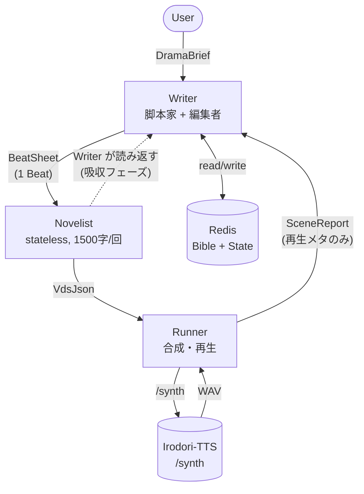
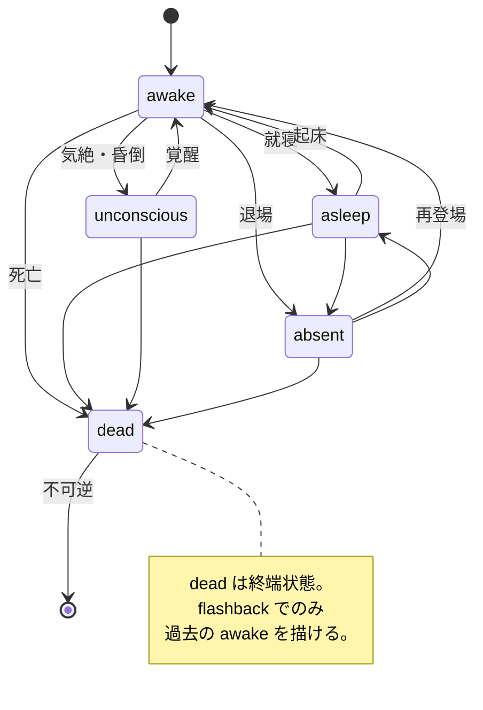
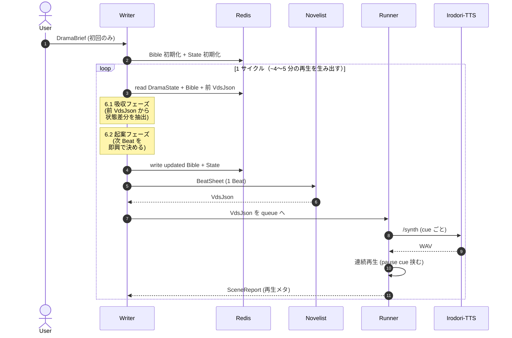

# ボイスドラマ生成エージェント間プロトコル仕様

ボイスドラマを LLM エージェント構成で連続生成するための、エージェント間で受け渡すメッセージの仕様を定義する。出力形式の VDS-JSON は `docs/voice-drama-format.md` に準拠する。

本ドキュメントは **仕様定義のみ** を扱い、エージェントの実装・LLM プロンプト・Runner の再生パイプラインは別タスクで行う。

---

## 1. 背景・狙い

単一 LLM に長時間ドラマを書かせると、主役の口調のズレ・ネタのループ・冗長化・整合性の破綻（寝たキャラが会話する、死んだキャラが復活する、季節が逆戻りする等）が早期に顕在化する。長期メモリの管理と 1 シーン単位の執筆を役割分離し、**Writer が Novelist の出力を読み返して状態を吸収するループ構造**にすることで、BGM として流しっぱなしにできる品質を維持する。

v1 は **即興ループ** に特化する。ラストやプロットを事前に決めない。「大まかな流れ → 小説家に書かせる → 脚本家が読んで重要情報を記憶 → 次の流れ」を繰り返す。

---

## 2. 設計方針

1. **即興ループ**。Bible は初期設定（キャラ・世界観）のみで走り出し、DramaState は Writer の吸収で育つ。ラスト・伏線・真相などは事前に決めない。
2. **事後吸収**。Writer は Beat の `effects` を事前宣言しない。Novelist が書いた VdsJson を Writer が読み返し、状態差分を取り出して DramaState / Bible を更新する。
3. **短いサイクルで連続運転**。1 回の Novelist 呼び出しは約 4〜5 分ぶん（本文 1500 字）に抑え、Writer がループでこれを連打することで任意長の再生を実現する。
4. **ハード制約とソフト記述の二層**。`status` / `location` / `worldTime` / `season` / `weather` はハード制約（機械で突合可能な enum・厳密型）、`mood` / `knownFacts` の content 部分などはソフト記述（LLM がソフトに効かせる）。
5. **Writer = stateful / Novelist = stateless**。長期メモリは Writer のみが保持し、Novelist は毎回渡されるコンテキストだけで書く。
6. **先読みパイプライン**。Runner は再生中に次 Beat の執筆・合成をキューに積み、切れ目を `pause` cue だけに留める。
7. **回想は独立した時空**。`sceneKind: 'flashback'` の Beat は DramaState に対して読み取り専用。過去の時刻・天気・死んだキャラなどを自由に描ける。

---

## 3. 責務分離



```
[User]
  │  DramaBrief                       （初期要求投入）
  ▼
[Writer: 脚本家]   ←→ Redis（DramaBible, DramaState）
  │  BeatSheet (= 1 Beat)             （次の流れを即興で決めて発注）
  ▼
[Novelist: 小説家] （stateless、1 回の出力は 1500 字以内）
  │  VdsJson                          （docs/voice-drama-format.md §4）
  ▼                    └─→ Writer が自分で VdsJson を読み返す（吸収フェーズ）
[Runner: 実行]     → /synth を順次実行、WAV を再生（先読み合成）
  │  SceneReport                     （再生メタ：cue 数・skip・実時間のみ）
  ▲
[Writer]                             （Report と吸収結果で DramaState を更新 → 次 BeatSheet）
```

**Writer は毎サイクル 2 役を兼ねる**：
- **脚本家**：「次の流れ」を決めて BeatSheet を発注する役
- **編集者**：Novelist が書いた VdsJson を読み返して Bible と DramaState を更新する役

実装上は 1 回の LLM 呼び出しで「前 VdsJson の吸収 + 次 Beat の起案」を同時に処理してよい。

---

## 4. メッセージ型

6 種類のメッセージで全ての受け渡しが完結する。全メッセージは `schemaVersion: 1` を持ち、破壊的変更時に版を上げる。

### 4.1 `DramaBrief`（User → Writer）

ユーザーから Writer への最初の要求。1 ドラマにつき 1 回送られる。

```ts
type DramaBrief = {
  schemaVersion: 1
  title?: string
  genre: string                       // 例: "日常SF", "ホラー", "ラブコメ"
  tone: string                        // 例: "軽妙", "静謐", "抒情的"
  characters: Array<{
    name: string
    role: string                      // "主人公", "相棒", "敵役" 等
    speechStyleHint: string
    speakerAlias: string              // VDS の alias（§3.4 規則に従う）
    speakerUuid: string               // Irodori-TTS の話者UUID
  }>
  includeNarrator: boolean            // ナレーター alias を Bible に含めるか（規約：true を既定）
  narratorUuid?: string               // includeNarrator=true のとき必須
  // 物語開始時点のハード状態
  initialWorldTime: { day: number; hhmm: string }
  initialSeason: Season
  initialWeather: Weather
  initialLocation: string
  ending: 'loop' | 'closed'           // v1 は 'loop' の挙動に最適化。'closed' は v2 の plotted モードで真価を発揮
  extraNotes?: string
}
```

**ナレーター運用規約:**
Bible の `speakers` に `narrator` alias を 1 つ含めることを推奨する。ナレーションは VDS-JSON の `speech` cue として `speaker: 'narrator'` で書く。VDS 仕様側に新 `kind` は追加しない。

### 4.2 `DramaBible`（Writer が Redis に保持）

ドラマ全体の長命状態。Writer のみが読み書きする。

```ts
type DramaBible = {
  schemaVersion: 1
  dramaId: string
  title: string
  genre: string
  tone: string
  premise: string                     // 数百字の設定要約
  world: string
  speakers: Record<string, {          // alias → 話者情報
    uuid: string
    persona: string                   // キャラ人物像（1〜3行）
    speechStyle: string               // 口調の具体例
    deprecated?: boolean              // /synth 404 検出時に立つ
  }>
  relationships: string
  // 物語内で言及された事実の台帳。初期は空。Writer が VdsJson の吸収で随時追記する。
  // v1 では Novelist へも全件開示してよい（戦略的な情報隠蔽は v2 の plotted モードで扱う）。
  facts: Record<string, Fact>
  createdAt: string                   // ISO8601
  updatedAt: string
}

type Fact = {
  factId: string
  content: string                     // 例: "主人公は3年前に実家を出ている"
  acquiredInBeatId: string             // どの Beat の吸収で追加されたか
}
```

### 4.3 `DramaState`（Writer が Redis に保持）

リアルタイム進行の状態。Writer の吸収で更新される。ハード制約とソフト記述を明確に分けて持つ。

**`flashback` の Beat は DramaState を一切更新しない（§6 参照）**。DramaState は常に「物語のリアルタイム現在」を指す。

```ts
type DramaState = {
  schemaVersion: 1
  dramaId: string

  // ── ハード制約（機械で突合する）─────────────────────
  worldTime: { day: number; hhmm: string }   // リアルタイムの物語内時間。単調増加のみ
  season: Season                             // リアルタイムの季節。後戻り禁止
  weather: Weather                           // リアルタイムの天気。Beat 間で変化可（急変は時間経過を挟む）
  currentLocation: string                    // リアルタイムの現在地
  characterStates: Record<string, {          // alias → ハード状態
    status: CharacterStatus
    location: string | null                  // null = 舞台外
    lastSeenBeatId: string
    // ── ソフト記述・知識 ────────────────────────
    mood: string                             // 感情。自由文
    knownFacts: FactRef[]                    // 知っている事実（DramaBible.facts への参照）
    inventory?: string[]
  }>

  // ── 進行 ─────────────────────────────────────
  recentBeats: BeatDigest[]                  // 直近 8 Beat 程度のダイジェスト
  totalPlayedSec: number
  nextBeatIdCounter: number
}

type CharacterStatus =
  | 'awake'         // 通常状態
  | 'asleep'        // 就寝中
  | 'unconscious'   // 気絶
  | 'dead'          // 死亡（不可逆）
  | 'absent'        // 舞台外

type Season =
  | 'early_spring'    // 3月         梅・桃
  | 'late_spring'     // 4-5月       桜・新緑
  | 'rainy_season'    // 6月         梅雨
  | 'midsummer'       // 7-8月       盛夏・夏祭り
  | 'early_autumn'    // 9月         残暑・中秋
  | 'late_autumn'     // 10-11月     紅葉・晩秋
  | 'early_winter'    // 12月        初冬・師走
  | 'midwinter'       // 1-2月       厳冬・雪

type Weather =
  | 'clear'           // 晴天、雲なし
  | 'sunny'           // 晴れ
  | 'partly_cloudy'   // 薄曇り
  | 'cloudy'          // 曇り
  | 'drizzle'         // 霧雨
  | 'rainy'           // 雨
  | 'stormy'          // 嵐・豪雨
  | 'thundery'        // 雷雨
  | 'snowy'           // 雪
  | 'blizzard'        // 吹雪
  | 'foggy'           // 霧

type FactRef = {
  factId: string                             // DramaBible.facts のキー
  acquiredInBeatId: string
  source: FactSource
  beliefStrength: 'certain' | 'suspecting' | 'rumor'
}

type FactSource =
  | { kind: 'witnessed' }                    // 直接目撃・体験
  | { kind: 'told'; by: string }             // 別 alias から聞いた
  | { kind: 'inferred' }                     // 既知情報からの推論
  | { kind: 'document'; docName: string }    // 書類・記録から

type BeatDigest = {
  beatId: string
  sceneKind: SceneKind
  summary: string                            // 1〜2 行の要約
  playedAt: string                           // ISO8601
}
```

**ハード制約の不変ルール:**

- `status` の `dead` は不可逆。`dead` → 他 status は Writer の吸収で拒否。
- `worldTime` は単調増加のみ（リアルタイム時刻）。
- `season` はリアルタイムでは後戻り禁止（`late_spring` → `rainy_season` → `midsummer` の順でのみ進む）。
- `weather` は Beat 間で自由に変化可。ただし `blizzard` → 次の Beat で `sunny` のような急変は時間経過（数時間以上）を挟む。
- `currentLocation` は Beat 間で変化可。瞬間移動を避けるため、遠距離の移動は中間 Beat（移動シーン or ナレーション）で埋めるのが望ましい（ハードルールではなく運用指針）。

**`CharacterStatus` の遷移図:**



### 4.4 `BeatSheet`（Writer → Novelist）

Novelist に渡す「次に書くべき 1 場面」の指示書。**1 BeatSheet = 1 Beat**。Writer は前サイクルの吸収と併せて次の BeatSheet を組む。

```ts
type BeatSheet = {
  schemaVersion: 1
  dramaId: string
  beat: Beat
  // Bible から抜き出した、この Beat で使ってよい話者のみのスナップショット。
  // Novelist はここにない alias を出力してはならない。
  speakers: Record<string, {
    uuid: string
    persona: string
    speechStyle: string
    // そのキャラが Beat 実行前時点で知っている事実の内容。Writer が Bible.facts と
    // characterStates[alias].knownFacts を突合して content を展開する。Novelist は
    // この範囲でのみ喋らせてよい。narrator も同じルールで絞り、語り手の全知化を避ける。
    knownFactsSnapshot: Array<{
      content: string
      beliefStrength: 'certain' | 'suspecting' | 'rumor'
    }>
  }>
  // 直近の流れ（200〜400字の要約）。前 Beat までの文脈を掴むためだけに使う。
  precedingSummary: string
  // 前 Beat 末尾の cue 2〜3 個を原文で含める。Beat 間の台詞接続を自然にする。
  precedingTailCues?: Array<{ speaker: string; text: string }>
  constraints: {
    maxCueTextLength: 200              // VDS §3.3 の保険
    maxBeatTextLength: 1500            // この Beat の speech.text 合計の上限
    maxCueCount: number                // 15 前後が目安
    allowedPauseRange: [number, number]  // pause.duration の許容範囲（秒）
  }
}

type SceneKind = 'realtime' | 'flashback'

type Beat = {
  beatId: string                       // dramaId 内でユニーク
  sceneKind: SceneKind
  goal: string                         // この Beat で達成したいこと（LLM 向けの指針）
  tension: 'low' | 'medium' | 'high'
  presentCharacters: string[]          // 登場する alias の配列（narrator 含めても良い）
  // realtime なら省略可（DramaState の時空を使う）。
  // flashback なら必須（この Beat 独自の時空を宣言）。
  sceneContext?: {
    worldTime: { day: number; hhmm: string }  // 過去の時刻（flashback の場合、DramaState.worldTime より過去）
    season: Season
    weather: Weather
    location: string
    characterOverrides?: Record<string, {     // 当時のキャラ状態の上書き（例: dead な人を awake に）
      status?: CharacterStatus
      location?: string | null
      mood?: string
    }>
  }
  flashbackViewpointAlias?: string     // flashback の視点主（任意）。純ナレーション回想なら省略
  seed?: number                        // 再現性のための共通 seed（任意）
}
```

**realtime の BeatSheet 組み立て:**

Writer は `DramaState` から以下をスナップショットして Novelist に渡す：
- `speakers`：`presentCharacters` に含まれ、かつ `characterStates[alias].status === 'awake'` かつ `characterStates[alias].location === DramaState.currentLocation` な alias のみ（`narrator` は例外で常時許可）
- `knownFactsSnapshot`：各 alias の `characterStates[alias].knownFacts` を `Bible.facts` と突合して content に展開

**flashback の BeatSheet 組み立て:**

Writer は `Beat.sceneContext` に過去の時空・キャラ状態を宣言する。Novelist へ渡す `speakers` と `knownFactsSnapshot` は、この `sceneContext` 時点で存在し・知っていた内容に絞る（未来情報の混入禁止は Writer の責任）。

### 4.5 `VdsJson`（Novelist → Runner）

Novelist の唯一の出力。スキーマは `docs/voice-drama-format.md §4` および `src/schemas/voice-drama.dto.ts` に準拠する。

制約：
- `speech.text` 合計が `constraints.maxBeatTextLength`（1500 字）を超えないこと
- 使用できる alias は `BeatSheet.speakers` のキーのみ
- 各 alias の発話内容は `speakers[alias].knownFactsSnapshot` の範囲に収める（Writer が渡していない事実をそのキャラが知っている前提で喋らせない）
- ナレーションが必要なら `speaker: 'narrator'` の speech cue として書く

### 4.6 `SceneReport`（Runner → Writer）

再生結果の **再生メタ** のみ。物語内容の要約は Writer が VdsJson を直接読んで作るため、ここには含めない。

```ts
type SceneReport = {
  schemaVersion: 1
  dramaId: string
  beatId: string
  playedCueCount: number
  skippedCues: Array<{
    index: number                      // VdsJson.cues 内のインデックス
    reason: 'synth_404' | 'synth_error' | 'schema_violation' | 'caption_unsupported'
    detail?: string
  }>
  actualDurationSec: number            // 実再生秒数（worldTime には反映しない、物語内時間は吸収で決める）
  playedAt: string                     // ISO8601
}
```

---

## 5. 状態の置き場（Redis）

既存の Redis をそのまま使う。キー設計は下記に従う。

| キー | 型 | 内容 | 寿命 |
|------|-----|------|------|
| `drama:<dramaId>:bible` | Hash / JSON string | `DramaBible` | 長命（ユーザーが削除するまで） |
| `drama:<dramaId>:state` | Hash / JSON string | `DramaState` | 長命（ドラマ終了で削除） |
| `drama:<dramaId>:queue:beats` | Stream | Novelist に発注予定の `BeatSheet` を積む | エフェメラル |
| `drama:<dramaId>:queue:vdsjson` | Stream | Novelist が書いた `VdsJson` を Runner と Writer が共有 | エフェメラル |
| `drama:<dramaId>:queue:reports` | Stream | Runner からの `SceneReport` を積む | エフェメラル |
| `drama:<dramaId>:lock:writer` | String (NX/EX) | Writer の二重起動防止 | 数十秒の TTL |

- 1 ドラマ = 1 `dramaId`。Discord のギルド × ユーザーで発番する想定（具体形は実装時に決める）。
- Writer は `dramaId` ごとにシングルトン。並行処理は別プロセスで分離する。
- `VdsJson` は Runner が合成に使うほか、Writer が吸収で読むため 2 者から参照される。

---

## 6. Writer の 1 サイクル手順

Writer は以下を繰り返す。初回は「吸収」ステップをスキップする。



### 6.1 吸収フェーズ（前サイクルの VdsJson を処理）

前サイクルの `VdsJson` と `SceneReport` を読んで状態を更新する。`Beat.sceneKind` に応じて処理が分岐する。

#### realtime の Beat

1. **物語内時間の進行推定**：VdsJson の本文と Beat の想定尺から、この Beat で進んだ物語内時間（分単位）を推定し、`DramaState.worldTime` を加算。
2. **場所の更新**：移動が描写されていれば `DramaState.currentLocation` を更新。
3. **キャラ状態の更新**：
   - `status` の変化（「寝た」「気絶した」等）を吸収 → `characterStates[alias].status` 更新。`dead` への遷移は不可逆、`dead` → 他は拒否。
   - `location` の変化 → `characterStates[alias].location` 更新。
   - `mood` の変化 → ソフトに更新。
4. **天気・季節の更新**：
   - `weather` が Beat 中に変化していれば（「雨が降り出した」等）更新。`blizzard` → 次で `sunny` のような急変は Beat に時間経過が描写されていることを確認。
   - `season` は経過日数（`worldTime.day` の進行）を見て進める。後戻り禁止。
5. **新 fact の抽出**：Beat で新たに言及された事実を `Bible.facts` に追加。各キャラの `knownFacts` にも `FactRef` として追加（誰が目撃した／誰に聞いた／推論した、を source に記録）。
6. **`skippedCues` の扱い**：`reason: 'synth_404'` なら `Bible.speakers[alias].deprecated = true` を立てる。該当 cue の内容は吸収から除外する（再生されていないため）。
7. **BeatDigest の追加**：`recentBeats` に `{ beatId, sceneKind: 'realtime', summary, playedAt }` を push（最大 8 個、溢れたら先頭から捨てる）。

#### flashback の Beat

1. **DramaState のリアルタイム軸は更新しない**：`worldTime` / `season` / `weather` / `currentLocation` / `characterStates` のハード層は変更しない。
2. **視点主の knownFacts のみ更新可**：`flashbackViewpointAlias` が指定されていれば、その alias の `characterStates[viewpoint].knownFacts` に「回想で確認された事実」を追加してよい。純ナレーション回想（視点主なし）の場合は `knownFacts` も更新しない（視聴者向けの情報開示として扱う）。
3. **Bible.facts への新 fact 追加は可**：物語世界の事実として台帳に載せる（以後の realtime Beat でも参照可能）。
4. **BeatDigest の追加**：`recentBeats` に `{ beatId, sceneKind: 'flashback', summary, playedAt }` を push。

### 6.2 起案フェーズ（次 BeatSheet の組み立て）

1. **sceneKind の決定**：通常は `realtime`。明示的に「ここで誰かが過去を思い出す」と判断した場合のみ `flashback`。
2. **goal の着想**：`DramaState` + `recentBeats` + `Bible` の設定から、次の流れ（会話の話題、移動、イベント）を決める。
3. **presentCharacters の絞り込み**：
   - **realtime**：`DramaState.characterStates[alias].status === 'awake'` かつ `location === DramaState.currentLocation` の alias のみ選択可。`narrator` は常時可。登場させたいが別場所・眠っているキャラがいる場合は、先に移動・起床の Beat を挟む。
   - **flashback**：`sceneContext.characterOverrides` で当時の状態を宣言し、それに従って選ぶ。
4. **sceneContext の構築**（flashback のみ必須）：過去の時刻・季節・天気・場所と、必要なら `characterOverrides` を宣言。`worldTime` は `DramaState.worldTime` より過去であること。
5. **`knownFactsSnapshot` の構築**：Beat 実行前時点の `knownFacts` から `Bible.facts[factId].content` を引いて展開。flashback ではその過去時点で知っていた範囲に絞る。
6. **`BeatSheet` 組み立て**：上記を通過した Beat に `speakers`、`precedingSummary`、`precedingTailCues`、`constraints` を同梱して発注。

### 6.3 1 LLM 呼び出しで兼ねる許可

Writer は **1 回の LLM 呼び出し**で「6.1 吸収」と「6.2 起案」を同時に処理してよい。入力に前 VdsJson と現 DramaState を渡し、出力として `{ stateDelta, newFacts, nextBeatSheet }` を Structured Output で受け取る。これによりコストとレイテンシを抑える。

---

## 7. 連続運転モデル

### 7.1 パイプライン

```mermaid
gantt
    title 先読みパイプライン（BGM 連続運転）
    dateFormat ss
    axisFormat %Mm%Ss

    section Beat 1
    執筆 (LLM ~20s)    :a1, 0, 20s
    合成 (TTS ~15s)    :a2, after a1, 15s
    再生 (~4-5分)      :a3, after a2, 270s

    section Beat 2
    執筆              :b1, after a1, 20s
    合成              :b2, after b1, 15s
    再生              :b3, after a3, 270s

    section Beat 3
    執筆              :c1, after b1, 20s
    合成              :c2, after c1, 15s
    再生              :c3, after b3, 270s
```



```
t=0     : Beat1 執筆(LLM ~20s) → 合成(TTS ~15s) → 再生(4〜5分)
t≈35s   :                       Beat2 執筆 → 合成 → 再生
t≈70s   :                                   Beat3 執筆 → 合成 → 再生
...
```

- Writer は SceneReport を**待たずに**次 Beat を投機的に執筆してよい（前 Beat の吸収が終わっていれば、その時点の DramaState で次を組める）。
- Runner は `queue:beats` から BeatSheet を pull し、Novelist を呼び、VdsJson を合成し、Beat 間に 1.5〜2.0 秒の `pause` cue を挿入して連続再生する。
- 再生の切れ目は pause cue のみ。BGM として違和感なく流れる。

### 7.2 先読み深度

- Runner は**再生中の Beat + 合成済みの Beat 2 つ**を常に保持する（合計 3 Beat バッファ）。
- Writer は**発注済み未合成の Beat 1 つ**を常に持つ（Runner の消費に先行して投入）。

### 7.3 ユーザー介入（v1 の最小構成）

- `/drama stop <dramaId>`: Writer のループ停止、Runner のキューを流し切って終了
- `/drama pause <dramaId>`: Runner のみ停止、キュー保持
- 途中での軌道修正（「この展開にして」）は v1 では未対応（§9）

---

## 8. エラー・リトライの合意

全てのメッセージ境界でバリデーションを走らせる。失敗時の扱いは以下に従う。

### 8.1 Novelist → Runner（`VdsJson` の不正）

| 原因 | 検出箇所 | 対応 |
|------|----------|------|
| Zod スキーマ違反 | Runner 手前のバリデータ | 同じ BeatSheet で Novelist に **最大 2 回** 再試行。失敗したら Beat を skip し `schema_violation` で Report |
| 未定義の alias 参照 | `VdsJsonSchema.superRefine` | 同上 |
| `speech.text` 合計が `maxBeatTextLength` 超 | バリデータ | 同上 |
| 1 cue の `text` が 200 字超 | `VdsJsonSchema` | 同上 |

### 8.2 Runner → Irodori-TTS（`/synth` 側の失敗）

| 原因 | 検出箇所 | 対応 |
|------|----------|------|
| UUID が `GET /speakers` に無い（404） | Runner | cue を skip、`reason: 'synth_404'`。Writer は吸収時に `Bible.speakers[alias].deprecated = true` を立てる |
| caption 経路が未対応（VDS §6.3） | Runner | skip、`reason: 'caption_unsupported'` |
| タイムアウト・5xx | Runner | 1 回だけリトライ。失敗したら skip、`reason: 'synth_error'` |

### 8.3 Writer の吸収で矛盾を検出した場合

例：Novelist が `dead` キャラを復活させて書いた、realtime の Beat で `season` が逆行した、等。Writer は以下の順で対応する：

1. **軽微な矛盾**（天気の急変、場所の飛躍）：吸収時に **Writer が辻褄を合わせる**（「どうやら時間が経ったらしい」等、Bible.facts に補足 fact を追加）。
2. **ハード違反**（dead 復活、season 逆行）：その Beat の内容を **部分的に無視**（該当する状態変化を適用しない）。Bible.facts には追加しない。recentBeats には `summary` を「（その Beat は本編に含まれない）」として記録。
3. **深刻な破綻**（登場キャラが全員不整合）：その Beat の `skippedCues` に `schema_violation` として全 cue を記録し、次サイクルで Writer が「続き」として穴埋め Beat を起案。

### 8.4 Writer の LLM 出力が JSON でない

Structured Output を前提とする。崩れた場合は同じ入力で再試行（最大 2 回）。連続で失敗したら、そのサイクルをスキップして次を待つ。Runner には波及させない。

---

## 9. 未定義・v2 以降で扱う拡張

v1 では扱わない。必要になったら `schemaVersion: 2` で追加する。

### 9.1 事前プロット / plotted モード
- `DramaBrief.mode: 'improv' | 'plotted'` の導入
- `Bible.arcPlan`（全体プロット、起承転結）
- `ending: 'closed'` 向けの「終幕に向けて収束させる」Writer 挙動

### 9.2 戦略的キャラ行動
- `Bible.speakers[alias].personalGoals.{overt, covert}`（表向きの目標／隠れた目標）
- `DramaState.characterStates[alias].strategies`（話題ごとの `truth` / `lie` / `deflect` / `silent` ポリシーと嘘の内容）
- Writer の「covertGoals と矛盾する Beat の起案回避」チェック

### 9.3 ミステリー拡張
- `Bible.secrets`（犯人・動機・手口を隠す台帳）
- `Bible.facts[].visibility: 'open' | 'restricted'`（Novelist への露出制御）
- `Beat.kind: 'clue_drop' | 'red_herring' | 'revelation'`
- `revelation` Beat 発注前の「探偵役の knownFacts で推理が成立するか」自己検証

### 9.4 2 階認知（Theory of Mind）
- `DramaState.characterStates[alias].perceivedKnowledge`（A は B がこの事実を知っていると思っている）
- `characterStates[alias].suspicionsTowards`（他 alias への疑い度）

### 9.5 伏線台帳
- `Bible.foreshadows`（`plantedInBeatId` / `resolvedInBeatId` による回収管理）

### 9.6 連続回想
- 複数 Beat を跨ぐ flashback（現 v1 は 1 Beat = 1 回想完結）
- `DramaState.flashbackContext` を一時的に持ち、回想中の時間を進める

### 9.7 ユーザーの途中介入
- `/drama nudge "<指示>"` で展開の軌道修正
- `/drama edit-bible` で Bible の直接編集

### 9.8 その他
- 並列進行（別視点・別場所を同時に描く）
- 夢・空想のシーン（`sceneKind: 'dream' | 'imagination'`）
- 複数 Writer の協調（ドラマ跨ぎの共通キャラ）
- ペット・NPC・純粋な環境音

---

## 10. 補足：このプロトコルの非目標

- **Novelist の汎用化**：Novelist は VDS-JSON を出す役割に固定。他形式への出力は想定しない。
- **LLM プロバイダの固定**：Writer と Novelist のモデルは不問。Structured Output が出せれば何でもよい。
- **リアルタイム性**：BGM 用途を主眼にしているため、初動レイテンシ 30〜60 秒を許容する。その後は先読みで切れ目なく流れる。
- **戦略的深み**：v1 は「状態整合のある即興会話」を目指す。キャラが意図を持って嘘をつく・駆け引きするシーンは v2 の plotted モードで扱う。

---

## 11. 変更履歴

| 版 | 日付 | 内容 |
|----|------|------|
| 1 (初版) | 2026-04-21 | 初版。5 メッセージ、Writer=stateful・Novelist=stateless、Redis 状態管理、エラー時は「skip して続行」。 |
| 1 (改訂) | 2026-04-21 | 短いサイクル連続運転モデルに再設計。1 BeatSheet = 1 Beat (1500 字)、先読みパイプライン、状態をハード制約とソフト記述の二層に分離。Beat に preconditions/effects を追加し、Writer の自己検証手順 §6 を新設。ナレーター運用規約を §4.1 に追記。 |
| 1 (改訂) | 2026-04-21 | `knownFacts` を構造化。`Bible.facts` 台帳を追加、`characterStates[].knownFacts` を `FactRef[]` に変更。`Beat.effects.revealFacts` を追加し、`BeatSheet.speakers` に `knownFactsSnapshot` を導入。 |
| 1 (改訂) | 2026-04-21 | **即興ループモデルに再設計**。事前宣言（`Beat.preconditions` / `effects`）を廃止し、Writer が VdsJson を読んで状態を更新する **事後吸収モデル** に変更。`Bible.facts` を初期空にし、Writer が吸収で追記していく形に。`SceneReport` を再生メタのみに縮小。`sceneKind: 'realtime' \| 'flashback'` と `sceneContext` で回想を独立時空としてサポート。`Season` を 8 分割 enum、`Weather` を 11 分割 enum として導入（realtime では後戻り禁止ルールあり）。戦略機能（covertGoals / strategies）・プロット駆動モード・ミステリー拡張・2 階認知などは §9 の v2 optional として切り出し。Writer の 1 サイクル手順を「吸収 → 起案」の 2 フェーズで §6 に再定義。 |
