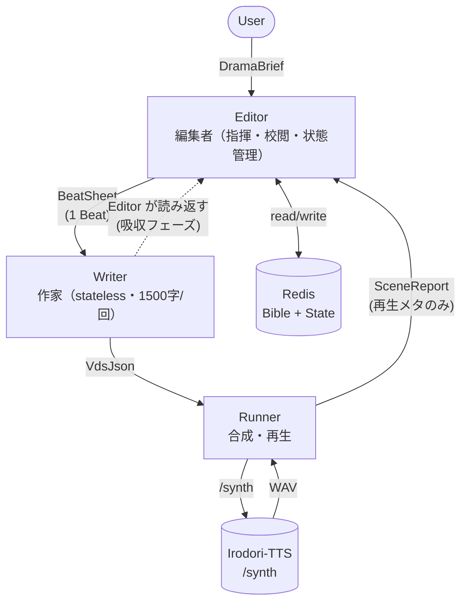

# ボイスドラマ生成エージェント間プロトコル仕様

ボイスドラマを LLM エージェント構成で連続生成するための、エージェント間で受け渡すメッセージの仕様を定義する。出力形式の VDS-JSON は `docs/voice-drama-format.md` に準拠する。

本ドキュメントは **仕様定義のみ** を扱い、エージェントの実装・LLM プロンプト・Runner の再生パイプラインは別タスクで行う。

---

## ドキュメント構成

| ファイル | 内容 |
|---|---|
| `README.md`（本ファイル） | 概要、§1 背景・狙い、§2 設計方針、§3 責務分離 |
| [`messages.md`](./messages.md) | §4 メッセージ型（DramaBrief / DramaBible / DramaState / BeatSheet / VdsJson / SceneReport の構造定義と CharacterSpec） |
| [`enums.md`](./enums.md) | 全 enum 定義のリファレンス（Genre / Role / AgeGroup / Gender / Race / SpeechStyle / Occupation / Personality / Attribute / Background / Relationship / CharacterStatus / Season / Weather / FactSource / SceneKind） |
| [`operations.md`](./operations.md) | §5 Redis、§6 Editor の 1 サイクル手順、§7 連続運転モデル、§8 エラー・リトライの合意 |
| [`roadmap.md`](./roadmap.md) | §9 v2 以降で扱う拡張、§10 非目標、§11 変更履歴 |

---

## 1. 背景・狙い

単一 LLM に長時間ドラマを書かせると、主役の口調のズレ・ネタのループ・冗長化・整合性の破綻（寝たキャラが会話する、死んだキャラが復活する、季節が逆戻りする等）が早期に顕在化する。長期メモリの管理と 1 シーン単位の執筆を役割分離し、**Editor が Writer の出力を読み返して状態を吸収するループ構造**にすることで、BGM として流しっぱなしにできる品質を維持する。

v1 は **即興ループ** に特化する。ラストやプロットを事前に決めない。「大まかな流れ → 作家に書かせる → 編集者が読んで重要情報を記憶 → 次の流れ」を繰り返す。

---

## 2. 設計方針

1. **即興ループ**。Bible は初期設定（キャラ・世界観）のみで走り出し、DramaState は Editor の吸収で育つ。ラスト・伏線・真相などは事前に決めない。
2. **事後吸収**。Editor は Beat の `effects` を事前宣言しない。Writer が書いた VdsJson を Editor が読み返し、状態差分を取り出して DramaState / Bible を更新する。
3. **短いサイクルで連続運転**。1 回の Writer 呼び出しは約 4〜5 分ぶん（本文 1500 字）に抑え、Editor がループでこれを連打することで任意長の再生を実現する。
4. **ハード制約とソフト記述の二層**。`status` / `location` / `worldTime` / `season` / `weather` はハード制約（Editor のコードで自動検証できる enum・厳密型。LLM の判断を介さない）、`mood` / `knownFacts` の content 部分などはソフト記述（LLM がソフトに効かせる）。
5. **Editor = stateful / Writer = stateless**。長期メモリは Editor のみが保持し、Writer は毎回渡されるコンテキストだけで書く。
6. **先読みパイプライン**。Runner は再生中に次 Beat の執筆・合成をキューに積み、切れ目を `pause` cue だけに留める。
7. **回想は独立した時空**。`sceneKind: 'flashback'` の Beat は DramaState に対して読み取り専用。過去の時刻・天気・死んだキャラなどを自由に描ける。
8. **粒度の境界**。User 入力は `DramaBrief` の粒度（ドラマ全体の方向性：ジャンル・トーン・キャラクターの基本属性・エンディング種別）に限定する。具体的な教室名、直近 Beat のあらすじ、`knownFactsSnapshot`、`precedingTailCues` 等の **細粒度情報は Editor ↔ Writer 間のやり取り（BeatSheet / VdsJson）内部で完結** させ、User が直接指定する経路は v1 では提供しない（v2 以降で `/drama nudge` 等による介入経路を検討、[`roadmap.md` §9.7](./roadmap.md#97-ユーザーの途中介入)）。

---

## 3. 責務分離



```
[User]
  │  DramaBrief                       （初期要求投入）
  ▼
[Editor: 編集者]   ←→ Redis（DramaBible, DramaState）
  │  BeatSheet (= 1 Beat)             （次の流れを即興で決めて発注）
  ▼
[Writer: 作家] （stateless、1 回の出力は 1500 字以内）
  │  VdsJson                          （docs/voice-drama-format.md §4）
  ▼                    └─→ Editor が自分で VdsJson を読み返す（吸収フェーズ）
[Runner: 実行]     → /synth を順次実行、WAV を再生（先読み合成）
  │  SceneReport                     （再生メタ：cue 数・skip・実時間のみ）
  ▲
[Editor]                             （Report と吸収結果で DramaState を更新 → 次 BeatSheet）
```

**Editor は毎サイクル 2 フェーズを回す**：
- **起案（指揮）**：「次の流れ」を決めて BeatSheet を発注する
- **校閲（吸収）**：Writer が書いた VdsJson を読み返して Bible と DramaState を更新する

実装上は 1 回の LLM 呼び出しで「前 VdsJson の吸収 + 次 Beat の起案」を同時に処理してよい（[`operations.md` §6.3](./operations.md#63-1-llm-呼び出しで兼ねる許可) 参照）。
