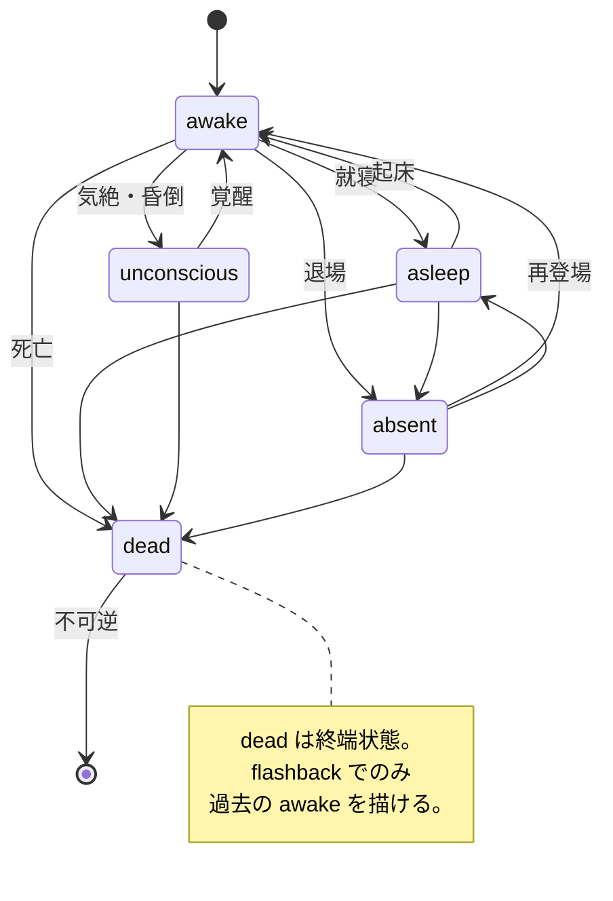

# メッセージ型

> 本書は [`README.md`](./README.md) の §4 に相当する。enum の値定義は [`enums.md`](./enums.md) 参照。

6 種類のメッセージで全ての受け渡しが完結する。全メッセージは `schemaVersion: 1` を持ち、破壊的変更時に版を上げる。

| # | 型 | 送信元 → 送信先 |
|---|---|---|
| 4.1 | [`DramaBrief`](#41-dramabriefuser--writer) | User → Writer |
| 4.2 | [`DramaBible`](#42-dramabiblewriter-が-redis-に保持) | Writer ↔ Redis |
| 4.3 | [`DramaState`](#43-dramastatewriter-が-redis-に保持) | Writer ↔ Redis |
| 4.4 | [`BeatSheet`](#44-beatsheetwriter--novelist) | Writer → Novelist |
| 4.5 | [`VdsJson`](#45-vdsjsonnovelist--runner) | Novelist → Runner |
| 4.6 | [`SceneReport`](#46-scenereportrunner--writer) | Runner → Writer |

---

## 4.1 `DramaBrief`（User → Writer）

ユーザーから Writer への最初の要求。1 ドラマにつき 1 回送られる。

```ts
type DramaBrief = {
  schemaVersion: 1
  title?: string

  genre: {
    categories: Genre[]               // 主ジャンル（1〜3 個推奨、最低 1 個必須）
    subgenre?: string                 // 自由文の補足（"スチームパンク", "ゾンビもの" 等、任意）
    tone: string                      // 情緒・雰囲気の自由文（例: "軽妙", "静謐", "抒情的"）
  }

  cast: {
    protagonist: string               // 主人公の alias（characters 配列内にちょうど 1 人）
    characters: CharacterSpec[]       // 型は下の CharacterSpec を参照
    narrator?: { uuid: string }       // 存在すればナレーター alias を Bible に含める
  }

  setting: {                           // 物語開始時点のハード状態
    worldTime: { day: number; hhmm: string }
    season: Season
    weather: Weather
    location: string
  }

  ending: 'loop' | 'closed'            // v1 は 'loop' の挙動に最適化。'closed' は v2 の plotted モードで真価を発揮
  notes?: string                       // 世界観補足・制作メモなど
}

type CharacterSpec = {
  name: string                        // 表示名（自由文）
  alias: string                       // VDS の alias（§3.4 規則に従う）
  uuid: string                        // Irodori-TTS の話者 UUID

  // ── 必須 enum（WebUI のドロップダウン想定） ───────────────
  role: Role
  ageGroup: AgeGroup
  gender: Gender
  race: Race                          // 現代モノは 'human' 固定
  speechStyle: SpeechStyle

  // ── 必須 enum 配列（WebUI のマルチセレクト） ──────────────
  traits: Trait[]                     // 性格タグ 1〜4 個

  // ── 主人公との関係性（必須） ─────────────────────────
  // 主人公自身のエントリは 'self' 固定。それ以外は 'self' 以外を必ず 1 つ選ぶ。
  relationship: Relationship
  relationshipNote?: string           // 例: "育ての親（血縁なし）", "5年前に別れた元恋人"

  // ── 任意 enum ───────────────────────────────────────
  occupation?: Occupation             // enum に無ければ 'other' + occupationNote
  attributes?: Attribute[]            // 属性タグ 0〜4 個
  background?: Background[]           // 経歴タグ 0〜3 個

  // ── 自由文補足（enum 粒度を越える情報） ──────────────────
  ageNote?: string                    // 例: "200歳（人間換算20代）"
  raceNote?: string                   // enum に無い種族の詳細
  occupationNote?: string             // 職業の詳細・文脈
  speechStyleNote?: string            // 方言の土地、口癖、特殊な語尾等
  personaNote?: string                // 目標・価値観・トラウマ等の総合補足
}
```

各 enum（`Genre` / `Role` / `AgeGroup` / `Gender` / `Race` / `SpeechStyle` / `Occupation` / `Trait` / `Attribute` / `Background` / `Relationship` / `Season` / `Weather`）の値定義は [`enums.md`](./enums.md) を参照。

**`genre` 運用規約:**
複数組み合わせ（「学園×ミステリ」「SF×サスペンス」「ファンタジー×ロマンス」等）を 1〜3 個まで許容する。enum でカバーしきれないニッチ要素（「スチームパンク」「バディもの」等）は `subgenre` の自由文で補う。流行り廃りのあるサブジャンル（「異世界転生」「デスゲーム」等）は enum に追加せず、`subgenre` で吸収する。

**`CharacterSpec` 運用規約:**

- `traits` は必須（1〜4 個）。2 個以上で個性の層を作る（例: `['cheerful', 'naive']` で明るいが世間知らず）。
- `attributes` は「キャラ属性タグ」で、日本のアニメ/ゲーム文化に寄せた慣用カテゴリ。不要なら省略。
- `race: 'human'` が現代モノの既定値。ファンタジー/SF 以外では変更しない。
- `ageNote` は `ageGroup` で表しきれない特殊ケース（長寿種、人間換算、AI の年齢非対称等）にのみ使う。
- `speechStyle: 'dialect_regional'` / `'eccentric'` を選んだ場合、`speechStyleNote` に詳細（方言の地方、口癖の具体例）を必ず書く。
- `occupation` が `'other'` のときは `occupationNote` を必須扱いする（運用規約）。

**主人公と関係性のルール:**

- `characters` 配列内で `role: 'protagonist'` を持つキャラは **ちょうど 1 人**。
- その 1 人の `alias` が `DramaBrief.cast.protagonist` と一致必須。
- 主人公の `relationship` は **`'self'`**（自身のエントリ）。
- それ以外のキャラの `relationship` は `'self'` 以外から必ず選ぶ。
- ナレーターは `role: 'narrator'` かつ `relationship: 'other'`（語り手は主人公との個人的関係を持たない扱い）。
- 他キャラ間の関係性（例：A さんと B さんは兄弟）は v1 では `DramaBible.relationships` の自由文でのみ表現する。キャラ組み合わせの enum 化は v2 optional（[`roadmap.md` §9.8](./roadmap.md#98-キャラ間関係マトリクス)）。

**ナレーター運用規約:**
Bible の `cast.speakers` に `narrator` alias を 1 つ含めることを推奨する。ナレーションは VDS-JSON の `speech` cue として `speaker: 'narrator'` で書く。VDS 仕様側に新 `kind` は追加しない。ナレーターは `CharacterSpec` の `role: 'narrator'`、`ageGroup: 'ageless'`、`gender: 'unknown'`、`race: 'other'`（`raceNote` に「語り手」）、`traits: ['stoic']` 等を既定値とする。

### 4.1.1 入力例：中学生 2 人の学園ライトノベル

主人公・桜羽エマと幼馴染・二階堂ヒロを中心に、学園生活をライトノベル風に流しっぱなしで楽しむ `'loop'` 用途の例。

```ts
const exampleBrief: DramaBrief = {
  schemaVersion: 1,
  title: '桜の咲く教室で',

  genre: {
    categories: ['school_life'],
    subgenre: 'ライトノベル風',
    tone: '軽妙で瑞々しい青春の手触り、ときどき照れくささが滲む'
  },

  cast: {
    protagonist: 'emma',
    characters: [
      {
        // ── 主人公：桜羽エマ ───────────────────────
        name: '桜羽エマ',
        alias: 'emma',
        uuid: '7c9e6a55-5b6a-4a4d-9c49-1d5a3b2f6cbb',  // 実話者 UUID に差し替える
        role: 'protagonist',
        ageGroup: 'teen',                   // 中学 2 年生 = 13〜14 歳 → teen (13-17)
        gender: 'female',
        race: 'human',
        speechStyle: 'casual_youthful',
        traits: ['cheerful', 'curious', 'emotional'],
        relationship: 'self',               // 主人公自身は 'self' 固定
        occupation: 'student_middle',
        attributes: ['genki'],
        background: ['late_bloomer'],
        personaNote:
          'クラスで文化祭実行委員を務める中学 2 年生。好奇心旺盛で、気になることがあると頭より先に足が出るタイプ。' +
          '幼馴染のヒロには頼りつつも、からかわれると素直にムキになってしまう。'
      },
      {
        // ── 幼馴染：二階堂ヒロ ─────────────────────
        name: '二階堂ヒロ',
        alias: 'hiro',
        uuid: '5680ac39-43c9-487a-bc3e-018c0d29cc38',
        role: 'companion',                  // 主人公と常に行動を共にする相棒
        ageGroup: 'teen',
        gender: 'male',
        race: 'human',
        speechStyle: 'casual_youthful',
        traits: ['stoic', 'logical', 'loyal'],
        relationship: 'childhood_friend',   // 幼馴染
        relationshipNote: '幼稚園からの付き合いで家が隣同士。朝はいつも一緒に登校する。',
        occupation: 'student_middle',
        attributes: ['glasses', 'bookworm'],
        personaNote:
          '口数は少ないが、エマの突飛な行動を冷静に拾ってフォローする役回り。' +
          '休み時間は文庫本か自作のノートパソコンに向かっていることが多い。'
      }
    ],
    narrator: { uuid: 'aaaaaaaa-bbbb-cccc-dddd-eeeeeeeeeeee' }  // 静かな三人称の語り手
  },

  setting: {
    worldTime: { day: 1, hhmm: '08:10' },  // 1 日目の朝、登校直後
    season: 'late_spring',                 // 4〜5 月、桜と新緑の時期
    weather: 'sunny',
    location: '桜ヶ丘中学校 2-A 教室'
  },

  ending: 'loop',                          // 起承転結を設けず日常を流し続ける
  notes:
    '恋愛要素は淡めで、ラブコメというより空気系寄り。' +
    'エマの突拍子もない思いつきと、ヒロの冷静なツッコミのやり取りを軸に、' +
    '昼休み・放課後・部活帰りなど細かなシーンを繋いで BGM として流す。'
}
```

**この例の設計ポイント**

| 選択 | 理由 |
|---|---|
| `ageGroup: 'teen'` | 中学 2 年生は 13〜14 歳なので `'preteen'`（10-12）ではなく `'teen'`（13-17） |
| `role` の使い分け | エマは `'protagonist'`、ヒロは常時同行する相棒なので `'companion'`（`'love_interest'` ではない） |
| `relationship: 'childhood_friend'` | 幼稚園からの幼馴染を表現。`'best_friend'` でも通るが、**長い時間を共有してきた関係**を明示したい場合はこちら |
| `traits` を 3 個 | 1 個（`cheerful` だけ等）だと単調になるので層を作る。エマは明るい＋好奇心＋感情的、ヒロは寡黙＋論理的＋忠実、で対比 |
| `attributes` | エマに `'genki'`（元気）、ヒロに `'glasses'` + `'bookworm'` を入れることでライトノベル的な立ち位置を明示 |
| `occupation: 'student_middle'` | 中学生を enum で明示。高校なら `'student_high'` |
| `subgenre: 'ライトノベル風'` | `Genre` enum には「ラノベ」カテゴリがないので `subgenre` で指定 |
| `ending: 'loop'` | BGM 用途なので起承転結を設けず無限に流す |
| `narrator` あり | 三人称の地の文でシーンの切り替えや心情描写を挟める（「桜の花びらが窓の外を舞った」等） |

**この Brief を投入すると**

Writer はこれを基に `DramaBible` を初期化し、毎サイクル以下のような Beat を即興で量産する：
- 朝のホームルーム前のやり取り
- 昼休みの購買めぐり
- 放課後の委員会・部活
- 帰り道でのお喋り

状態（天気・時刻・場所）は Writer の吸収で進行し、`'late_spring'` → `'rainy_season'` → `'midsummer'` と季節が移っても整合が保たれる。

---

## 4.2 `DramaBible`（Writer が Redis に保持）

ドラマ全体の長命状態。Writer のみが読み書きする。

```ts
type DramaBible = {
  schemaVersion: 1
  dramaId: string
  title: string

  genre: {                             // DramaBrief.genre から引き継ぐ
    categories: Genre[]
    subgenre?: string
    tone: string
  }

  cast: {                              // DramaBrief.cast を詳細化した形
    protagonist: string                // 主人公の alias
    speakers: Record<string, SpeakerEntry>  // alias → 話者情報（下の SpeakerEntry 参照）
  }

  premise: string                      // 数百字の設定要約
  world: string
  relationships: string                // 他キャラ間の関係（v1 は自由文のみ、roadmap §9.8 参照）
  // 物語内で言及された事実の台帳。初期は空。Writer が VdsJson の吸収で随時追記する。
  // v1 では Novelist へも全件開示してよい（戦略的な情報隠蔽は v2 の plotted モードで扱う）。
  facts: Record<string, Fact>
  createdAt: string                    // ISO8601
  updatedAt: string
}

type Fact = {
  factId: string
  content: string                     // 例: "主人公は3年前に実家を出ている"
  acquiredInBeatId: string             // どの Beat の吸収で追加されたか
}

// CharacterSpec をそのまま展開し、Bible 固有のシステム領域を追加。
// Writer は DramaBrief.cast.characters から SpeakerEntry を初期化する際、
// speechStyle や personaNote を必要に応じて詳細化してよい。
type SpeakerEntry = CharacterSpec & {
  deprecated?: boolean                // /synth 404 検出時に立つ
}
```

---

## 4.3 `DramaState`（Writer が Redis に保持）

リアルタイム進行の状態。Writer の吸収で更新される。ハード制約とソフト記述を明確に分けて持つ。

**`flashback` の Beat は DramaState を一切更新しない（[`operations.md` §6](./operations.md#6-writer-の-1-サイクル手順) 参照）**。DramaState は常に「物語のリアルタイム現在」を指す。

```ts
type DramaState = {
  schemaVersion: 1
  dramaId: string

  // ── ハード制約（機械で突合する）─────────────────────
  worldTime: { day: number; hhmm: string }   // リアルタイムの物語内時間。単調増加のみ
  season: Season                             // リアルタイムの季節。後戻り禁止
  weather: Weather                           // リアルタイムの天気。Beat 間で変化可（急変は時間経過を挟む）
  location: string                           // リアルタイムの現在地（DramaBrief.setting.location から引き継ぐ）
  characterStates: Record<string, {          // alias → ハード状態
    status: CharacterStatus
    location: string | null                  // null = 舞台外
    lastSeenBeatId: string
    // ── ソフト記述・知識 ────────────────────────
    mood: string                             // 感情。自由文
    knownFacts: FactRef[]                    // 知っている事実（DramaBible.facts への参照）
    inventory?: string[]
  }>

  // ── 進行 ─────────────────────────────────────
  recentBeats: BeatDigest[]                  // 直近 8 Beat 程度のダイジェスト
  totalPlayedSec: number
  nextBeatIdCounter: number
}

type FactRef = {
  factId: string                             // DramaBible.facts のキー
  acquiredInBeatId: string
  source: FactSource
  beliefStrength: 'certain' | 'suspecting' | 'rumor'
}

type BeatDigest = {
  beatId: string
  sceneKind: SceneKind
  summary: string                            // 1〜2 行の要約
  playedAt: string                           // ISO8601
}
```

`CharacterStatus` / `Season` / `Weather` / `FactSource` / `SceneKind` の値は [`enums.md`](./enums.md) を参照。

**ハード制約の不変ルール:**

- `status` の `dead` は不可逆。`dead` → 他 status は Writer の吸収で拒否。
- `worldTime` は単調増加のみ（リアルタイム時刻）。
- `season` はリアルタイムでは後戻り禁止（`late_spring` → `rainy_season` → `midsummer` の順でのみ進む）。
- `weather` は Beat 間で自由に変化可。ただし `blizzard` → 次の Beat で `sunny` のような急変は時間経過（数時間以上）を挟む。
- `location` は Beat 間で変化可。瞬間移動を避けるため、遠距離の移動は中間 Beat（移動シーン or ナレーション）で埋めるのが望ましい（ハードルールではなく運用指針）。

**`CharacterStatus` の遷移図:**



---

## 4.4 `BeatSheet`（Writer → Novelist）

Novelist に渡す「次に書くべき 1 場面」の指示書。**1 BeatSheet = 1 Beat**。Writer は前サイクルの吸収と併せて次の BeatSheet を組む。

```ts
type BeatSheet = {
  schemaVersion: 1
  dramaId: string
  beat: Beat
  // Bible から抜き出した、この Beat で使ってよい話者のみのスナップショット。
  // Novelist はここにない alias を出力してはならない。
  speakers: Record<string, {
    uuid: string
    persona: string
    speechStyle: string
    // そのキャラが Beat 実行前時点で知っている事実の内容。Writer が Bible.facts と
    // characterStates[alias].knownFacts を突合して content を展開する。Novelist は
    // この範囲でのみ喋らせてよい。narrator も同じルールで絞り、語り手の全知化を避ける。
    knownFactsSnapshot: Array<{
      content: string
      beliefStrength: 'certain' | 'suspecting' | 'rumor'
    }>
  }>
  // 直近の流れ（200〜400字の要約）。前 Beat までの文脈を掴むためだけに使う。
  precedingSummary: string
  // 前 Beat 末尾の cue 2〜3 個を原文で含める。Beat 間の台詞接続を自然にする。
  precedingTailCues?: Array<{ speaker: string; text: string }>
  constraints: {
    maxCueTextLength: 200              // VDS §3.3 の保険
    maxBeatTextLength: 1500            // この Beat の speech.text 合計の上限
    maxCueCount: number                // 15 前後が目安
    allowedPauseRange: [number, number]  // pause.duration の許容範囲（秒）
  }
}

type Beat = {
  beatId: string                       // dramaId 内でユニーク
  sceneKind: SceneKind
  goal: string                         // この Beat で達成したいこと（LLM 向けの指針）
  tension: 'low' | 'medium' | 'high'
  presentCharacters: string[]          // 登場する alias の配列（narrator 含めても良い）
  // realtime なら省略可（DramaState の時空を使う）。
  // flashback なら必須（この Beat 独自の時空を宣言）。
  sceneContext?: {
    worldTime: { day: number; hhmm: string }  // 過去の時刻（flashback の場合、DramaState.worldTime より過去）
    season: Season
    weather: Weather
    location: string
    characterOverrides?: Record<string, {     // 当時のキャラ状態の上書き（例: dead な人を awake に）
      status?: CharacterStatus
      location?: string | null
      mood?: string
    }>
  }
  flashbackViewpointAlias?: string     // flashback の視点主（任意）。純ナレーション回想なら省略
  seed?: number                        // 再現性のための共通 seed（任意）
}
```

**realtime の BeatSheet 組み立て:**

Writer は `DramaState` から以下をスナップショットして Novelist に渡す：
- `speakers`：`presentCharacters` に含まれ、かつ `characterStates[alias].status === 'awake'` かつ `characterStates[alias].location === DramaState.location` な alias のみ（`narrator` は例外で常時許可）
- `knownFactsSnapshot`：各 alias の `characterStates[alias].knownFacts` を `Bible.facts` と突合して content に展開

**flashback の BeatSheet 組み立て:**

Writer は `Beat.sceneContext` に過去の時空・キャラ状態を宣言する。Novelist へ渡す `speakers` と `knownFactsSnapshot` は、この `sceneContext` 時点で存在し・知っていた内容に絞る（未来情報の混入禁止は Writer の責任）。

---

## 4.5 `VdsJson`（Novelist → Runner）

Novelist の唯一の出力。スキーマは `docs/voice-drama-format.md §4` および `src/schemas/voice-drama.dto.ts` に準拠する。

制約：
- `speech.text` 合計が `constraints.maxBeatTextLength`（1500 字）を超えないこと
- 使用できる alias は `BeatSheet.speakers` のキーのみ
- 各 alias の発話内容は `speakers[alias].knownFactsSnapshot` の範囲に収める（Writer が渡していない事実をそのキャラが知っている前提で喋らせない）
- ナレーションが必要なら `speaker: 'narrator'` の speech cue として書く

---

## 4.6 `SceneReport`（Runner → Writer）

再生結果の **再生メタ** のみ。物語内容の要約は Writer が VdsJson を直接読んで作るため、ここには含めない。

```ts
type SceneReport = {
  schemaVersion: 1
  dramaId: string
  beatId: string
  playedCueCount: number
  skippedCues: Array<{
    index: number                      // VdsJson.cues 内のインデックス
    reason: 'synth_404' | 'synth_error' | 'schema_violation' | 'caption_unsupported'
    detail?: string
  }>
  actualDurationSec: number            // 実再生秒数（worldTime には反映しない、物語内時間は吸収で決める）
  playedAt: string                     // ISO8601
}
```
