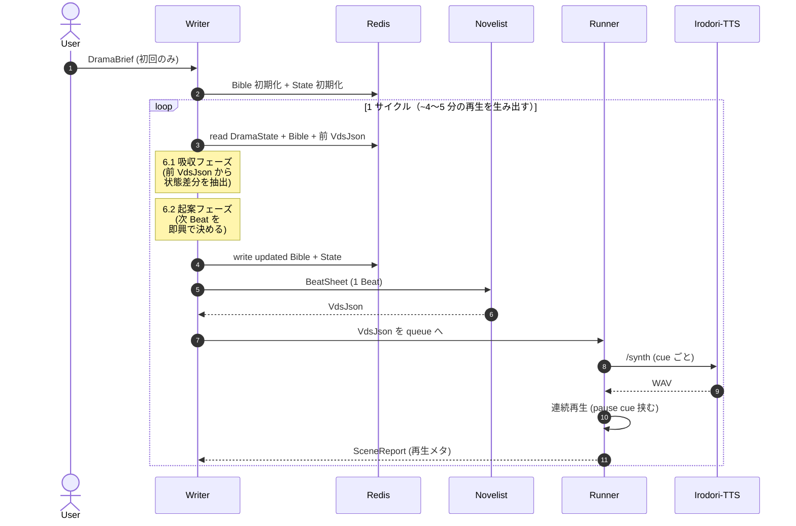

# 実行モデル：状態管理・Writer サイクル・パイプライン・エラー

> 本書は [`README.md`](./README.md) の §5〜§8 に相当する。メッセージ型の構造は [`messages.md`](./messages.md)、enum 値は [`enums.md`](./enums.md) を参照。

---

## 5. 状態の置き場（Redis）

既存の Redis をそのまま使う。キー設計は下記に従う。

| キー | 型 | 内容 | 寿命 |
|------|-----|------|------|
| `drama:<dramaId>:bible` | Hash / JSON string | `DramaBible` | 長命（ユーザーが削除するまで） |
| `drama:<dramaId>:state` | Hash / JSON string | `DramaState` | 長命（ドラマ終了で削除） |
| `drama:<dramaId>:queue:beats` | Stream | Novelist に発注予定の `BeatSheet` を積む | エフェメラル |
| `drama:<dramaId>:queue:vdsjson` | Stream | Novelist が書いた `VdsJson` を Runner と Writer が共有 | エフェメラル |
| `drama:<dramaId>:queue:reports` | Stream | Runner からの `SceneReport` を積む | エフェメラル |
| `drama:<dramaId>:lock:writer` | String (NX/EX) | Writer の二重起動防止 | 数十秒の TTL |

- 1 ドラマ = 1 `dramaId`。Discord のギルド × ユーザーで発番する想定（具体形は実装時に決める）。
- Writer は `dramaId` ごとにシングルトン。並行処理は別プロセスで分離する。
- `VdsJson` は Runner が合成に使うほか、Writer が吸収で読むため 2 者から参照される。

---

## 6. Writer の 1 サイクル手順

Writer は以下を繰り返す。初回は「吸収」ステップをスキップする。



### 6.1 吸収フェーズ（前サイクルの VdsJson を処理）

前サイクルの `VdsJson` と `SceneReport` を読んで状態を更新する。`Beat.sceneKind` に応じて処理が分岐する。

#### realtime の Beat

1. **物語内時間の進行推定**：VdsJson の本文と Beat の想定尺から、この Beat で進んだ物語内時間（分単位）を推定し、`DramaState.worldTime` を加算。
2. **場所の更新**：移動が描写されていれば `DramaState.location` を更新。
3. **キャラ状態の更新**：
   - `status` の変化（「寝た」「気絶した」等）を吸収 → `characterStates[alias].status` 更新。`dead` への遷移は不可逆、`dead` → 他は拒否。
   - `location` の変化 → `characterStates[alias].location` 更新。
   - `mood` の変化 → ソフトに更新。
4. **天気・季節の更新**：
   - `weather` が Beat 中に変化していれば（「雨が降り出した」等）更新。`blizzard` → 次で `sunny` のような急変は Beat に時間経過が描写されていることを確認。
   - `season` は経過日数（`worldTime.day` の進行）を見て進める。後戻り禁止。
5. **新 fact の抽出**：Beat で新たに言及された事実を `Bible.facts` に追加。各キャラの `knownFacts` にも `FactRef` として追加（誰が目撃した／誰に聞いた／推論した、を source に記録）。
6. **`skippedCues` の扱い**：`reason: 'synth_404'` なら `Bible.cast.speakers[alias].deprecated = true` を立てる。該当 cue の内容は吸収から除外する（再生されていないため）。
7. **BeatDigest の追加**：`recentBeats` に `{ beatId, sceneKind: 'realtime', summary, playedAt }` を push（最大 8 個、溢れたら先頭から捨てる）。

#### flashback の Beat

1. **DramaState のリアルタイム軸は更新しない**：`worldTime` / `season` / `weather` / `location` / `characterStates` のハード層は変更しない。
2. **視点主の knownFacts のみ更新可**：`flashbackViewpointAlias` が指定されていれば、その alias の `characterStates[viewpoint].knownFacts` に「回想で確認された事実」を追加してよい。純ナレーション回想（視点主なし）の場合は `knownFacts` も更新しない（視聴者向けの情報開示として扱う）。
3. **Bible.facts への新 fact 追加は可**：物語世界の事実として台帳に載せる（以後の realtime Beat でも参照可能）。
4. **BeatDigest の追加**：`recentBeats` に `{ beatId, sceneKind: 'flashback', summary, playedAt }` を push。

### 6.2 起案フェーズ（次 BeatSheet の組み立て）

1. **sceneKind の決定**：通常は `realtime`。明示的に「ここで誰かが過去を思い出す」と判断した場合のみ `flashback`。
2. **goal の着想**：`DramaState` + `recentBeats` + `Bible` の設定から、次の流れ（会話の話題、移動、イベント）を決める。
3. **presentCharacters の絞り込み**：
   - **realtime**：`DramaState.characterStates[alias].status === 'awake'` かつ `location === DramaState.location` の alias のみ選択可。`narrator` は常時可。登場させたいが別場所・眠っているキャラがいる場合は、先に移動・起床の Beat を挟む。
   - **flashback**：`sceneContext.characterOverrides` で当時の状態を宣言し、それに従って選ぶ。
4. **sceneContext の構築**（flashback のみ必須）：過去の時刻・季節・天気・場所と、必要なら `characterOverrides` を宣言。`worldTime` は `DramaState.worldTime` より過去であること。
5. **`knownFactsSnapshot` の構築**：Beat 実行前時点の `knownFacts` から `Bible.facts[factId].content` を引いて展開。flashback ではその過去時点で知っていた範囲に絞る。
6. **`BeatSheet` 組み立て**：上記を通過した Beat に `speakers`、`precedingSummary`、`precedingTailCues`、`constraints` を同梱して発注。

### 6.3 1 LLM 呼び出しで兼ねる許可

Writer は **1 回の LLM 呼び出し**で「6.1 吸収」と「6.2 起案」を同時に処理してよい。入力に前 VdsJson と現 DramaState を渡し、出力として `{ stateDelta, newFacts, nextBeatSheet }` を Structured Output で受け取る。これによりコストとレイテンシを抑える。

---

## 7. 連続運転モデル

### 7.1 パイプライン

```mermaid
gantt
    title 先読みパイプライン（BGM 連続運転）
    dateFormat ss
    axisFormat %Mm%Ss

    section Beat 1
    執筆 (LLM ~20s)    :a1, 0, 20s
    合成 (TTS ~15s)    :a2, after a1, 15s
    再生 (~4-5分)      :a3, after a2, 270s

    section Beat 2
    執筆              :b1, after a1, 20s
    合成              :b2, after b1, 15s
    再生              :b3, after a3, 270s

    section Beat 3
    執筆              :c1, after b1, 20s
    合成              :c2, after c1, 15s
    再生              :c3, after b3, 270s
```



```
t=0     : Beat1 執筆(LLM ~20s) → 合成(TTS ~15s) → 再生(4〜5分)
t≈35s   :                       Beat2 執筆 → 合成 → 再生
t≈70s   :                                   Beat3 執筆 → 合成 → 再生
...
```

- Writer は SceneReport を**待たずに**次 Beat を投機的に執筆してよい（前 Beat の吸収が終わっていれば、その時点の DramaState で次を組める）。
- Runner は `queue:beats` から BeatSheet を pull し、Novelist を呼び、VdsJson を合成し、Beat 間に 1.5〜2.0 秒の `pause` cue を挿入して連続再生する。
- 再生の切れ目は pause cue のみ。BGM として違和感なく流れる。

### 7.2 先読み深度

- Runner は**再生中の Beat + 合成済みの Beat 2 つ**を常に保持する（合計 3 Beat バッファ）。
- Writer は**発注済み未合成の Beat 1 つ**を常に持つ（Runner の消費に先行して投入）。

### 7.3 ユーザー介入（v1 の最小構成）

- `/drama stop <dramaId>`: Writer のループ停止、Runner のキューを流し切って終了
- `/drama pause <dramaId>`: Runner のみ停止、キュー保持
- 途中での軌道修正（「この展開にして」）は v1 では未対応（[`roadmap.md` §9.7](./roadmap.md#97-ユーザーの途中介入)）

---

## 8. エラー・リトライの合意

全てのメッセージ境界でバリデーションを走らせる。失敗時の扱いは以下に従う。

### 8.1 Novelist → Runner（`VdsJson` の不正）

| 原因 | 検出箇所 | 対応 |
|------|----------|------|
| Zod スキーマ違反 | Runner 手前のバリデータ | 同じ BeatSheet で Novelist に **最大 2 回** 再試行。失敗したら Beat を skip し `schema_violation` で Report |
| 未定義の alias 参照 | `VdsJsonSchema.superRefine` | 同上 |
| `speech.text` 合計が `maxBeatTextLength` 超 | バリデータ | 同上 |
| 1 cue の `text` が 200 字超 | `VdsJsonSchema` | 同上 |

### 8.2 Runner → Irodori-TTS（`/synth` 側の失敗）

| 原因 | 検出箇所 | 対応 |
|------|----------|------|
| UUID が `GET /speakers` に無い（404） | Runner | cue を skip、`reason: 'synth_404'`。Writer は吸収時に `Bible.cast.speakers[alias].deprecated = true` を立てる |
| caption 経路が未対応（VDS §6.3） | Runner | skip、`reason: 'caption_unsupported'` |
| タイムアウト・5xx | Runner | 1 回だけリトライ。失敗したら skip、`reason: 'synth_error'` |

### 8.3 Writer の吸収で矛盾を検出した場合

例：Novelist が `dead` キャラを復活させて書いた、realtime の Beat で `season` が逆行した、等。Writer は以下の順で対応する：

1. **軽微な矛盾**（天気の急変、場所の飛躍）：吸収時に **Writer が辻褄を合わせる**（「どうやら時間が経ったらしい」等、Bible.facts に補足 fact を追加）。
2. **ハード違反**（dead 復活、season 逆行）：その Beat の内容を **部分的に無視**（該当する状態変化を適用しない）。Bible.facts には追加しない。recentBeats には `summary` を「（その Beat は本編に含まれない）」として記録。
3. **深刻な破綻**（登場キャラが全員不整合）：その Beat の `skippedCues` に `schema_violation` として全 cue を記録し、次サイクルで Writer が「続き」として穴埋め Beat を起案。

### 8.4 Writer の LLM 出力が JSON でない

Structured Output を前提とする。崩れた場合は同じ入力で再試行（最大 2 回）。連続で失敗したら、そのサイクルをスキップして次を待つ。Runner には波及させない。
