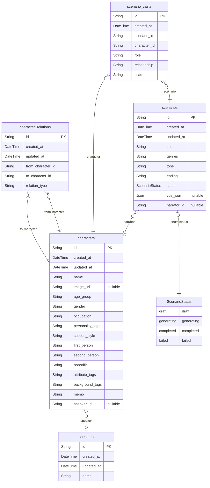

```mermaid
erDiagram

        ScenarioStatus {
            draft draft
generating generating
completed completed
failed failed
        }
    
  "characters" {
    String id "PK"
    DateTime created_at 
    DateTime updated_at 
    String name 
    String image_url "nullable"
    String age_group 
    String gender 
    String occupation 
    String personality_tags 
    String speech_style 
    String first_person 
    String second_person 
    String honorific 
    String attribute_tags 
    String background_tags 
    String memo 
    String speaker_id "nullable"
    }
  

  "speakers" {
    String id "PK"
    DateTime created_at 
    DateTime updated_at 
    String name 
    }
  

  "character_relations" {
    String id "PK"
    DateTime created_at 
    DateTime updated_at 
    String from_character_id 
    String to_character_id 
    String relation_type 
    }
  

  "scenarios" {
    String id "PK"
    DateTime created_at 
    DateTime updated_at 
    String title 
    String genres 
    String tone 
    String ending 
    ScenarioStatus status 
    Json vds_json "nullable"
    String narrator_id "nullable"
    }
  

  "scenario_casts" {
    String id "PK"
    DateTime created_at 
    String scenario_id 
    String character_id 
    String role 
    String relationship 
    String alias 
    }
  
    "characters" }o--|o speakers : "speaker"
    "character_relations" }o--|| characters : "fromCharacter"
    "character_relations" }o--|| characters : "toCharacter"
    "scenarios" |o--|| "ScenarioStatus" : "enum:status"
    "scenarios" }o--|o characters : "narrator"
    "scenario_casts" }o--|| scenarios : "scenario"
    "scenario_casts" }o--|| characters : "character"
```
