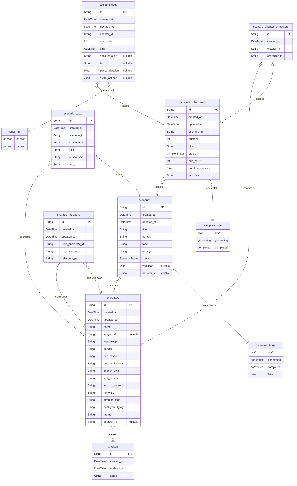

```mermaid
erDiagram

        ScenarioStatus {
            draft draft
generating generating
completed completed
failed failed
        }
    


        ChapterStatus {
            draft draft
generating generating
completed completed
        }
    


        CueKind {
            speech speech
pause pause
        }
    
  "characters" {
    String id "PK"
    DateTime created_at 
    DateTime updated_at 
    String name 
    String image_url "nullable"
    String age_group 
    String gender 
    String occupation 
    String personality_tags 
    String speech_style 
    String first_person 
    String second_person 
    String honorific 
    String attribute_tags 
    String background_tags 
    String memo 
    String speaker_id "nullable"
    }
  

  "speakers" {
    String id "PK"
    DateTime created_at 
    DateTime updated_at 
    String name 
    }
  

  "character_relations" {
    String id "PK"
    DateTime created_at 
    DateTime updated_at 
    String from_character_id 
    String to_character_id 
    String relation_type 
    }
  

  "scenarios" {
    String id "PK"
    DateTime created_at 
    DateTime updated_at 
    String title 
    String genres 
    String tone 
    String ending 
    ScenarioStatus status 
    Json vds_json "nullable"
    String narrator_id "nullable"
    }
  

  "scenario_casts" {
    String id "PK"
    DateTime created_at 
    String scenario_id 
    String character_id 
    String role 
    String relationship 
    String alias 
    }
  

  "scenario_chapters" {
    String id "PK"
    DateTime created_at 
    DateTime updated_at 
    String scenario_id 
    Int number 
    String title 
    ChapterStatus status 
    Int cue_count 
    Float duration_minutes 
    String synopsis 
    }
  

  "scenario_chapter_characters" {
    String id "PK"
    DateTime created_at 
    String chapter_id 
    String character_id 
    }
  

  "scenario_cues" {
    String id "PK"
    DateTime created_at 
    DateTime updated_at 
    String chapter_id 
    Int cue_order 
    CueKind kind 
    String speaker_alias "nullable"
    String text "nullable"
    Float pause_duration "nullable"
    Json synth_options "nullable"
    }
  
    "characters" }o--|o speakers : "speaker"
    "character_relations" }o--|| characters : "fromCharacter"
    "character_relations" }o--|| characters : "toCharacter"
    "scenarios" |o--|| "ScenarioStatus" : "enum:status"
    "scenarios" }o--|o characters : "narrator"
    "scenario_casts" }o--|| scenarios : "scenario"
    "scenario_casts" }o--|| characters : "character"
    "scenario_chapters" |o--|| "ChapterStatus" : "enum:status"
    "scenario_chapters" }o--|| scenarios : "scenario"
    "scenario_chapter_characters" }o--|| scenario_chapters : "chapter"
    "scenario_chapter_characters" }o--|| characters : "character"
    "scenario_cues" |o--|| "CueKind" : "enum:kind"
    "scenario_cues" }o--|| scenario_chapters : "chapter"
```
